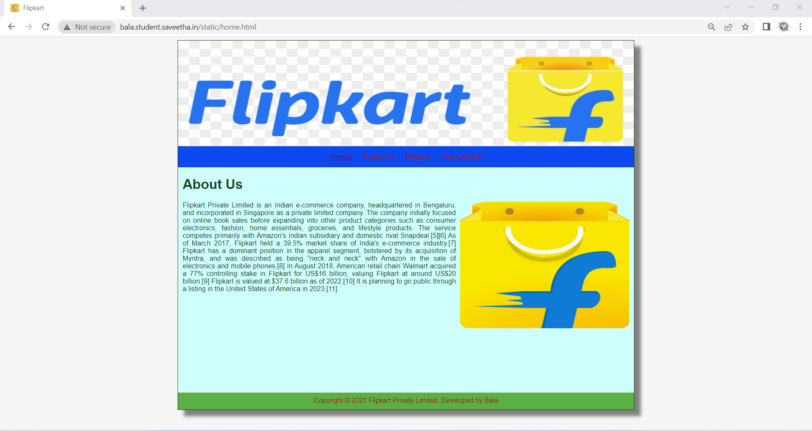
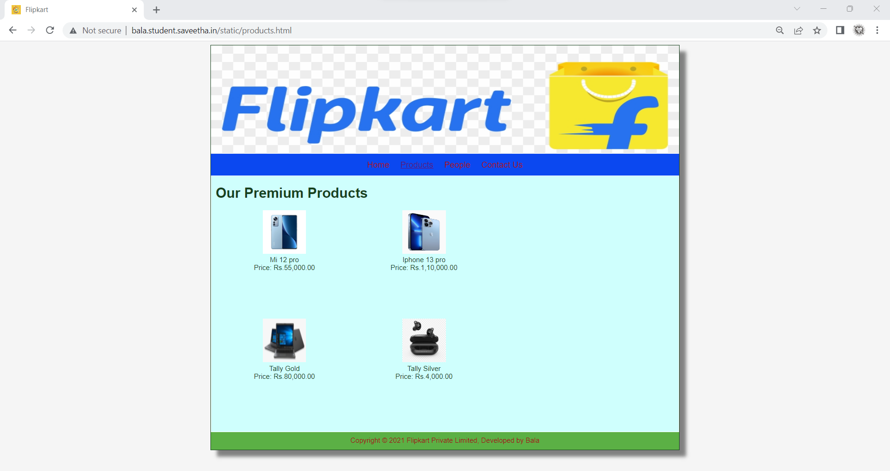
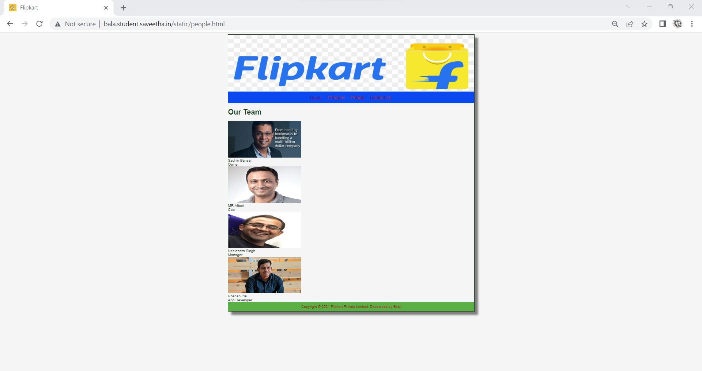
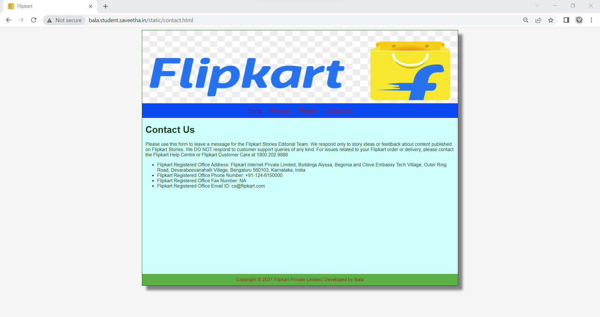
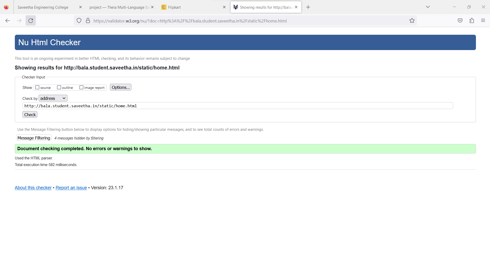

# Web Design for a Software Product Company

## AIM:

To design a static website for a software product company company.

## DESIGN STEPS:

### Step 1:

Requirement collection.

### Step 2:

Creating the layout using HTML and CSS.

### Step 3:

Updating the sample content.

### Step 4:

Choose the appropriate style and color scheme.

### Step 5:

Validate the layout in various browsers.

### Step 6:

Validate the HTML code.

### Step 6:

Publish the website in the given URL.

## PROGRAM :

Homepage.html Code::
```
<!DOCTYPE html>
<html lang="en">
  <head>
    <title>Flipkart</title>
    <link rel="stylesheet" href="./css/layout.css" />
    <link rel="icon" href="./img/flip2.jpg" type="image/x-icon" />
  </head>

  <body>
    <div class="container">
      <div class="banner"></div>
      <div class="menu">
        <div class="menuitemselected"><a href="/static/home.html">Home</a></div>
        <div class="menuitem"><a href="/static/products.html">Products</a></div>
        <div class="menuitem"><a href="/static/people.html">People</a></div>
        <div class="menuitem"><a href="/static/contact.html">Contact Us</a></div>
      </div>
      <div class="content">
        <div class="homecontent">
          <h1>About Us</h1>
          
          <div class="contenttext">
            Flipkart Private Limited is an Indian e-commerce company, headquartered in Bengaluru, and incorporated in Singapore as a private limited company. The company initially focused on online book sales before expanding into other product categories such as consumer electronics, fashion, home essentials, groceries, and lifestyle products.
            The service competes primarily with Amazon's Indian subsidiary and domestic rival Snapdeal.[5][6] As of March 2017, Flipkart held a 39.5% market share of India's e-commerce industry.[7] Flipkart has a dominant position in the apparel segment, bolstered by its acquisition of Myntra, and was described as being "neck and neck" with Amazon in the sale of electronics and mobile phones.[8]
            In August 2018, American retail chain Walmart acquired a 77% controlling stake in Flipkart for US$16 billion, valuing Flipkart at around US$20 billion.[9] Flipkart is valued at $37.6 billion as of 2022.[10] It is planning to go public through a listing in the United States of America in 2023.[11] 
          </div>
        </div>
      </div>
      <div class="footer">
        Copyright &#169; 2021 Flipkart Private Limited, Developed by Bala
      </div>
    </div>
  </body>
</html>
```

Products.html Code:
```
<!DOCTYPE html>
<html lang="en">
  <head>
    <title>Flipkart</title>
    <link rel="stylesheet" href="./css/layout.css" />
    <link rel="icon" href="./img/flip2.jpg" type="image/x-icon" />
  </head>

  <body>
    <div class="container">
      <div class="banner"></div>
      <div class="menu">
        <div class="menuitem"><a href="/static/home.html">Home</a></div>
        <div class="menuitemselected">
          <a href="/static/products.html">Products</a>
        </div>
        <div class="menuitem"><a href="/static/people.html">People</a></div>
        <div class="menuitem"><a href="/static/contact.html">Contact Us</a></div>
      </div>
      <div class="content">
        <div class="productcontent">    
          <h1>Our Premium Products</h1>
          <div class="productitems">
              <div class="productitem"> 
                  <div class="itemimage">
                  
                  </div>
                  <div class="itemname">Mi 12 pro</div>
                  <div class="itemprice">Price: Rs.55,000.00 </div>
              </div>
              <div class="productitem"> 
                  <div class="itemimage">
                  
                  </div>
                  <div class="itemname">Iphone 13 pro</div>
                  <div class="itemprice">Price: Rs.1,10,000.00 </div>
              </div>
          </div>
          <div class="productitems">
              <div class="productitem"> 
                  <div class="itemimage">
                  
                  </div>
                  <div class="itemname">Tally Gold</div>
                  <div class="itemprice">Price: Rs.80,000.00 </div>
              </div>
              <div class="productitem"> 
                  <div class="itemimage">
                  
                  </div>
                  <div class="itemname">Tally Silver</div>
                  <div class="itemprice">Price: Rs.4,000.00 </div>
              </div>
          </div>
          </div>        
      </div>
      <div class="footer">
        Copyright &#169; 2021 Flipkart Private Limited, Developed by Bala
      </div>
    </div>
  </body>
</html>
```

People.html Code:
```
<!DOCTYPE html>
<html lang="en">
  <head>
    <title>Flipkart</title>
    <link rel="stylesheet" href="./css/layout.css" />
    <link rel="icon" href="./img/flip2.jpg" type="image/x-icon" />
  </head>

  <body>
    <div class="container">
      <div class="banner"></div>
      <div class="menu">
        <div class="menuitemselected"><a href="/static/home.html">Home</a></div>
        <div class="menuitem"><a href="/static/products.html">Products</a></div>
        <div class="menuitem"><a href="/static/people.html">People</a></div>
        <div class="menuitem"><a href="/static/contact.html">Contact Us</a></div>
      </div>
      <h1>Our Team</h1>
            <div class="peopleitems">
                <div class="peopleitem">
                    <div class="peopleimage">
                    
                    </div>
                    <div class="peoplename">Sachin Bansal</div>
                    <div class="peoplepos">Owner</div>
                </div>
            <div class="peoplecontent"> 
                <div class="peopleitems">
                    <div class="peopleitem"> 
                        <div class="peopleimage">
                        
                        </div>
                        <div class="peoplename">MR.Albert</div>
                        <div class="peoplepos">Ceo</div>
                    </div>
            <div class="peoplecontent">
                <div class="peopleitems">
                    <div class="peopleitem"> 
                        <div class="peopleimage">
                        
                        </div>
                        <div class="peoplepos">Neelendra Singh</div>
                        <div class="peoplepos">Manager</div>
                    </div>               
            <div class="peoplecontent">
                <div class="peopleitem"> 
                    <div class="peopleimage">
                        <div class="peopleitems">
                        
                        </div>
                        <div class="peoplename">Roshan Pai</div>
                        <div class="peoplepos">App Developer</div>
                    </div>
                </div>
            </div>         
        </div>
    </div>
    <div class="footer">
        Copyright &#169; 2021 Flipkart Private Limited, Developed by Bala
    </div>
    </body>
</html>
```

Contact.html Code:
```
<!DOCTYPE html>
<html lang="en">
  <head>
    <title>Flipkart</title>
    <link rel="stylesheet" href="./css/layout.css" />
    <link rel="icon" href="./img/flip2.jpg" type="image/x-icon" />
  </head>

  <body>
    <div class="container">
      <div class="banner"></div>
      <div class="menu">
        <div class="menuitemselected"><a href="/static/home.html">Home</a></div>
        <div class="menuitem"><a href="/static/products.html">Products</a></div>
        <div class="menuitem"><a href="/static/people.html">People</a></div>
        <div class="menuitem"><a href="/static/contact.html">Contact Us</a></div>
      </div>
      <div class="content">
        <div class="homecontent">
          <h1>Contact Us</h1>
           Please use this form to leave a message for the Flipkart Stories Editorial Team. We respond only to story ideas or feedback about content published on Flipkart Stories. 
           We DO NOT respond to customer support queries of any kind. 
           For issues related to your Flipkart order or delivery, please contact the Flipkart Help Centre or Flipkart Customer Care at 1800 202 9898
           <ul>
               <li>Flipkart Registered Office Address: Flipkart Internet Private Limited, Buildings Alyssa, Begonia and Clove Embassy Tech Village, Outer Ring Road, Devarabeesanahalli Village, Bengaluru 560103, Karnataka, India</li>
               <li>Flipkart Registered Office Phone Number: +91-124-6150000</li>
               <li>Flipkart Registered Office Fax Number: NA</li>
               <li>Flipkart Registered Office Email ID: cs@flipkart.com</li>
           </ul>
        </div>
      </div>
      <div class="footer">
        Copyright &#169; 2021 Flipkart Private Limited, Developed by Bala
      </div>
    </div>      
  </body>
</html>
```

## OUTPUT:

### Home Page:



### Product Page:



### People Page:



### Contact us Page:



### Validation:



## Result:

Thus a website is designed for the software product company and the HTML,CSS code are validated.
